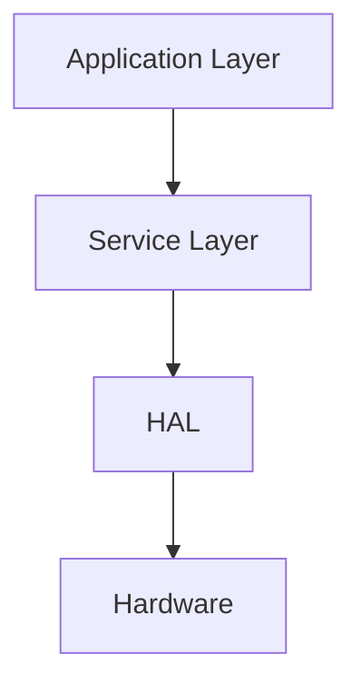
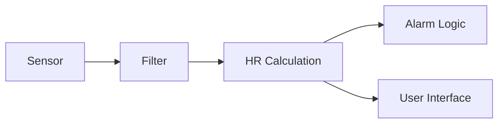
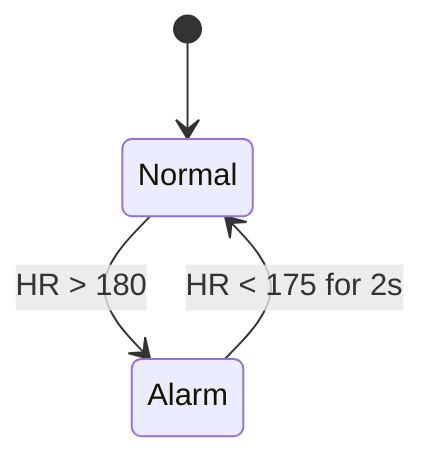

# Session 2 – Architecture & Design (Simple Version)

## 1. Why Architecture Matters
Architecture is the blueprint of the system.  
Good architecture makes testing easier, reduces bugs, and improves safety.

---

## 2. What Architecture Should Do
A good architecture:
- Separates safety-critical from non‑critical code  
- Keeps modules simple and independent  
- Makes testing easier  
- Ensures predictable timing  
- Prevents one component from breaking everything  

---

## 3. Basic Architecture Layers

1. **Application Layer** – heart‑rate logic, alarms, UI  
2. **Service Layer** – timers, logging, utilities  
3. **HAL Layer** – drivers and peripherals  
4. **Hardware** – MCU, sensors, battery  

---

## 4. Safety Class Separation (A/B/C)

| Class | Meaning | Example |
|------|---------|---------|
| **A** | No harm | UI graphics |
| **B** | Minor harm | HR measurement |
| **C** | Serious harm | Alarm logic |

Rule: **Class C must not depend on Class A.**

---

## 5. Simple Architecture Pattern (Our Device)

---

## 6. Common Design Mistakes to Avoid
- One huge file (god module)  
- UI code that triggers safety logic  
- Too many global variables  
- Cyclic dependencies  
- Missing error handling  

---

## 7. Heart‑Rate System Example Modules
- **HR_Filter (B)** – removes noise  
- **HR_Calculator (B)** – computes BPM  
- **Alarm_Manager (C)** – checks thresholds  
- **Display_Manager (A)** – UI output  

Example rule:  
**Alarm_Manager only reads BPM from HR_Calculator. It never touches UI or sensor code.**

---

## 8. Mini State Machine Example

---

## 9. Architecture Verification Checklist
- Are modules independent?  
- Are safety classes separated?  
- Are data flows clearly defined?  
- Can each block be tested on its own?  

---

## 10. Summary
- Architecture = system structure  
- Keep modules small and independent  
- Separate safety classes  
- Document data flow  
- Avoid coupling UI with safety logic  