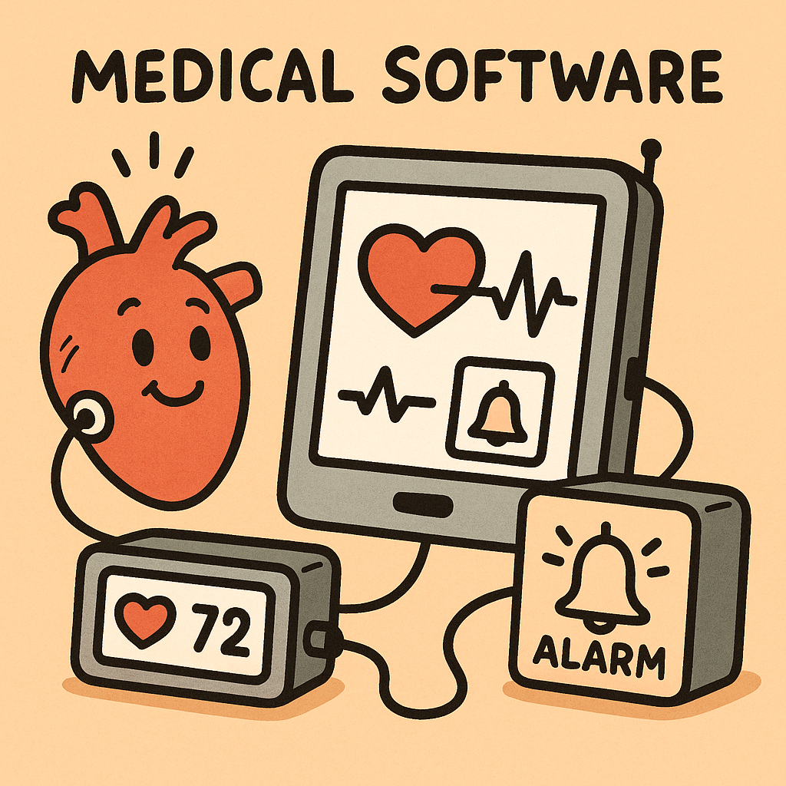
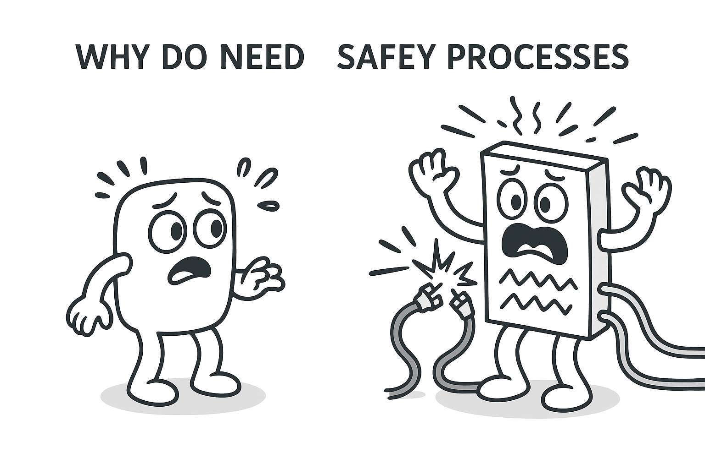
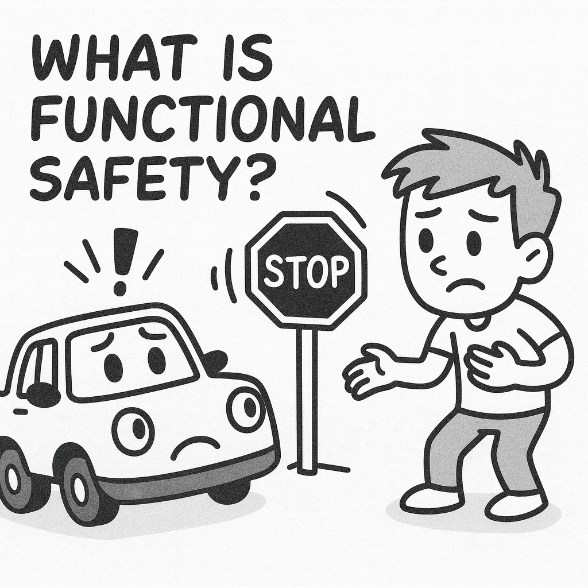
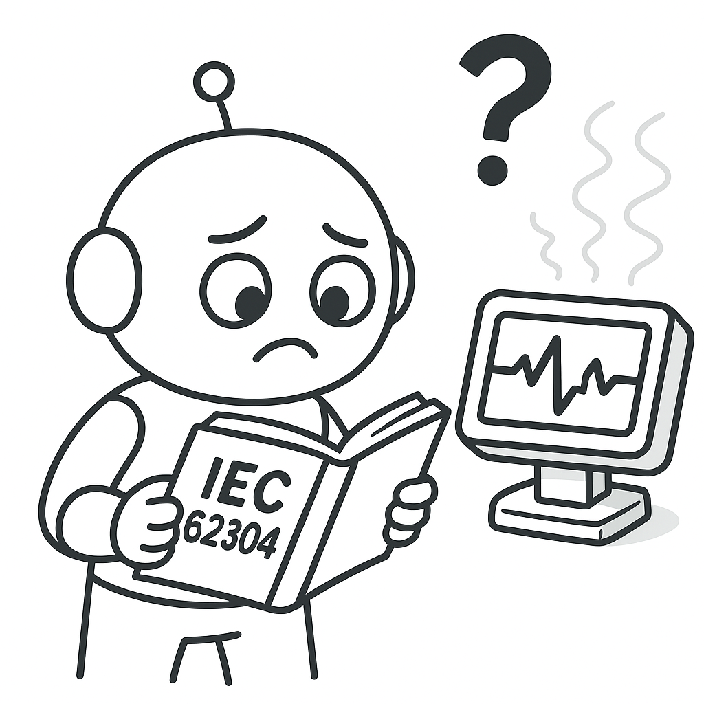
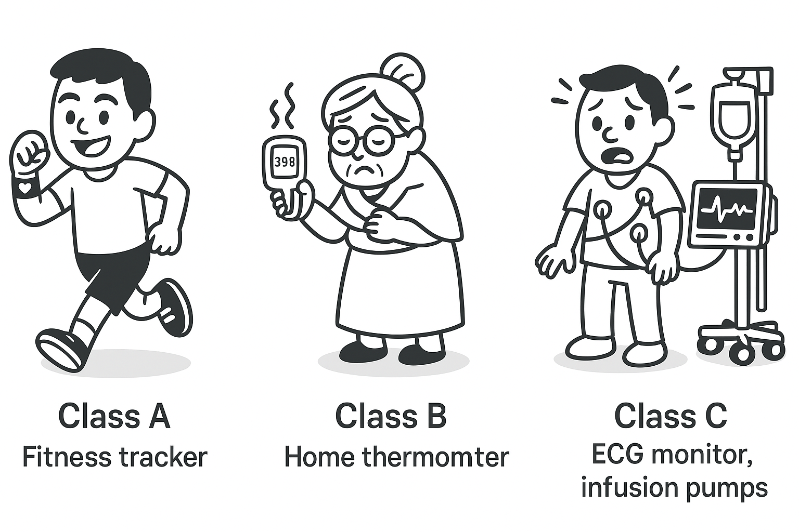
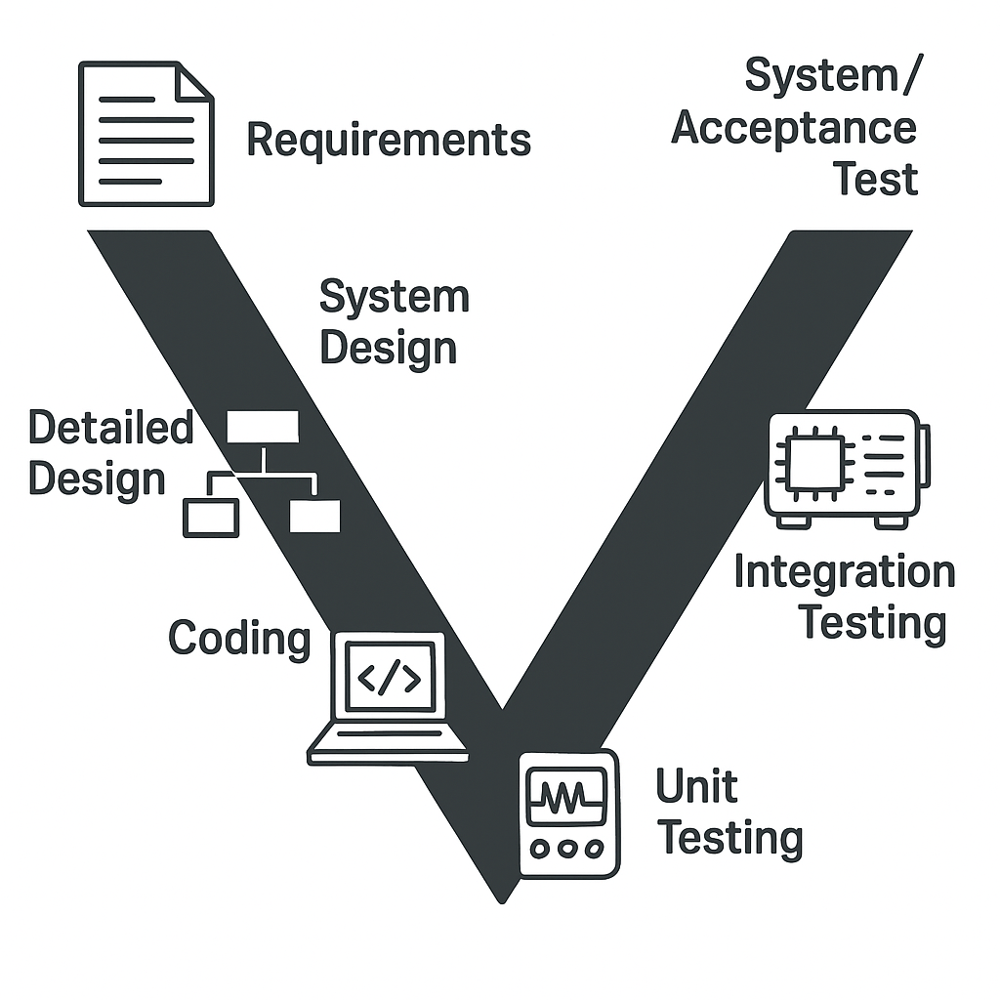
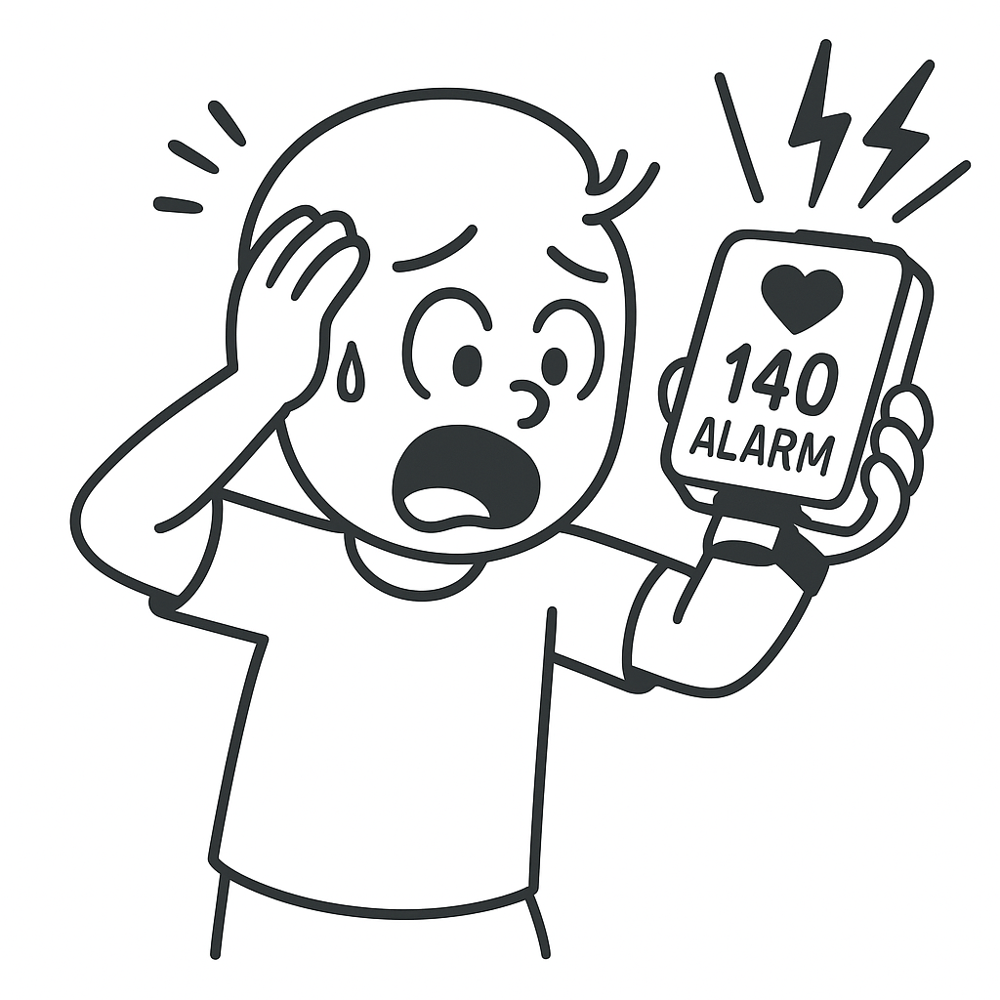

# IEC 62304 for Embedded Medical Software – A Practical Introduction
# Introduction

## 1. What Is Medical Software?

Medical software is any software that helps monitor, diagnose, or treat people.  
Examples include:
- Heart rate monitors  
- Blood pressure sensors  
- Insulin pumps  
- Hospital patient monitors  

If a mistake happens in these systems, it can affect a person’s health.  
This is why medical software must follow **strict rules**.

---

## 2. Why Do We Need Safety Processes?

In normal electronics or Arduino projects, if code fails, nothing serious happens.  
But in medical devices, failures can cause:
- Wrong readings  
- Missing alarms  
- Incorrect decisions  
- Patient risk  

So we use **functional safety**: a structured way of building software to reduce risks.

Think of it like:
- Following a recipe instead of guessing  
- Double‑checking steps to avoid mistakes  
- Making sure everything works before using it on real people  

---

## 3. What Is Functional Safety?

Functional safety means making sure a system behaves correctly **even when something goes wrong**.

Functional safety applies to many industries, not only medical devices.  
Other examples include:
- **Automotive** (airbags, ABS, braking control — ISO 26262)  
- **Industrial machines** (robot arms, factory automation)  
- **Home appliances** (safety shut‑off, temperature protection)  
- **Aerospace** (redundant sensors, flight control safety)

The core idea is always the same:  
Make sure the system stays safe even if a component, sensor, or software part fails.

### What is a Hazard?
A **hazard** is anything that can potentially cause harm.
Examples:
- Incorrect heart‑rate reading  
- Sensor disconnecting  
- Alarm not activating  

### What is Risk?
**Risk = how bad the harm is × how likely it is to happen.**

Even small devices can create risk if:
- They give wrong health data  
- They miss important warnings  

### What is a Safety Function?
A **safety function** is a part of the system designed to reduce risk.
Examples:
- Triggering an alarm when heart rate is too high  
- Detecting sensor failure  
- Providing default safe behavior  

Functional safety ensures:
- Hazards are identified  
- Risks are understood  
- Safety functions reduce those risks  

This is the foundation for IEC 62304.

---

## 4. What Is IEC 62304?

IEC 62304 is an international **rulebook** that explains:
- How to plan medical software
- How to design it safely
- How to write the code correctly
- How to test the software
- How to handle bugs

It does **not** tell you how to write C or use sensors.  
It tells you **the process you must follow** to ensure safety.

A simple analogy:
> Arduino teaches you “how to code.”  
> IEC 62304 teaches you “how to behave when making medical software.”

---

## 5. Safety Classes (A/B/C)

IEC 62304 sorts software into three categories:

| Class | What It Means | Example |
|-------|----------------|---------|
| **A** | No possible harm | Step counter |
| **B** | Possible non-serious injury | Home heart-rate monitor |
| **C** | Possible serious injury or death | Hospital ECG monitor |

---

## 6. The V‑Model (The Medical Development Roadmap)

The V‑Model is a clear step‑by‑step method used in medical projects.

### Left side: Planning  
You decide what the system should do:
- Requirements (what needs to happen)
- Architecture (how parts fit together)
- Design (details)

### Middle: Coding  
You write the actual C code.

### Right side: Testing  
You test the system to prove it works:
- Unit tests
- Integration tests
- System tests

**Every step must match a test.**  
If you say “the system must alert at 180 bpm,” there must be a test that proves it.

---

## 7. Our Simple Learning Example  

We learn IEC 62304 using a **multi‑function Health Device Example**:
1. Read heart rate from a sensor  
2. Read temperature from a small digital thermometer  
3. Check if values are out of safe limits  
4. Trigger an alert (buzzer/LED) if needed  
5. Log basic events (e.g., “high HR detected”) for later review  

This shows that medical software often does **more than just monitoring**:
- It can combine multiple sensor inputs  
- It can make decisions  
- It can alert users  
- It can store information  

---

## 8. What You Will Learn in This Course
*Suggested image: four‑step course roadmap (Intro → Architecture → Coding → Testing).*

Across the 4 sessions, you will learn:

### Session 1 — Introduction & Requirement
- What medical software is  
- Why safety rules exist  
- What IEC 62304 is  
- The V‑Model 
- How to write requirement for a project

### Session 2 — Architecture  
- Turning ideas into diagrams  
- Simple state machines  
- System structure (sensor → logic → alarm)

### Session 3 — Coding  
- Writing safe C code  
- Avoiding dangerous practices  
- Implementing the heart rate alert logic

### Session 4 — Testing  
- Unit tests  
- Integration tests  
- Traceability from requirement to test

---

## 9. Summary  

You now understand the “big picture”:
- Medical software must be safe  
- IEC 62304 defines the development process  
- We use the V‑Model to plan and test  
- A small example will guide you step‑by‑step