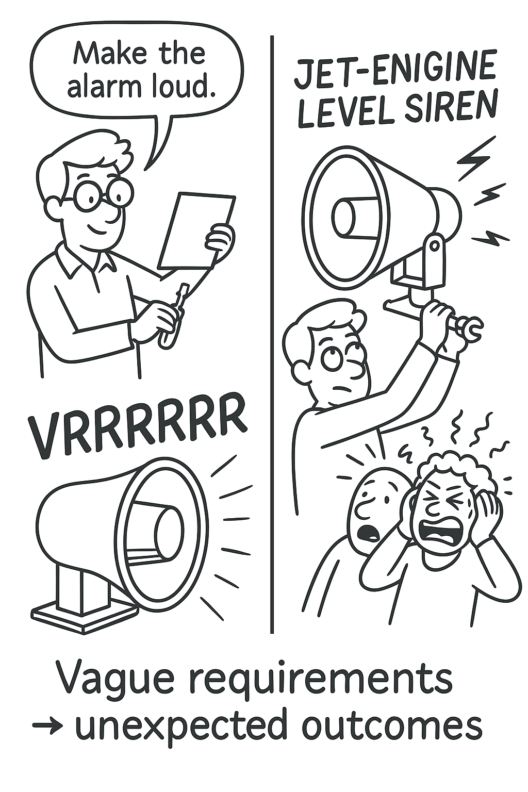
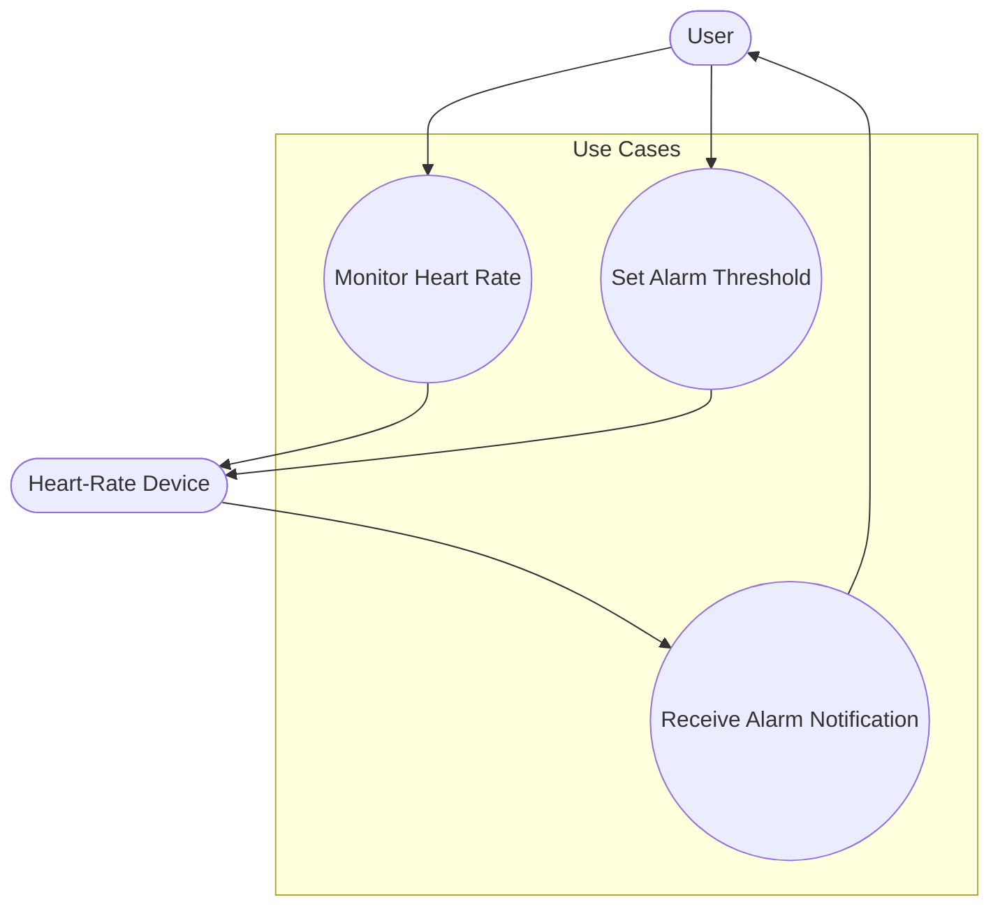
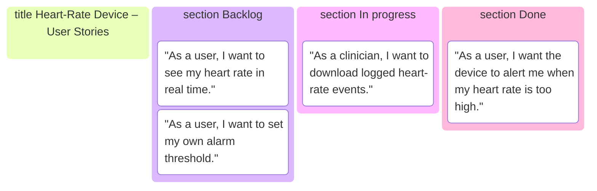
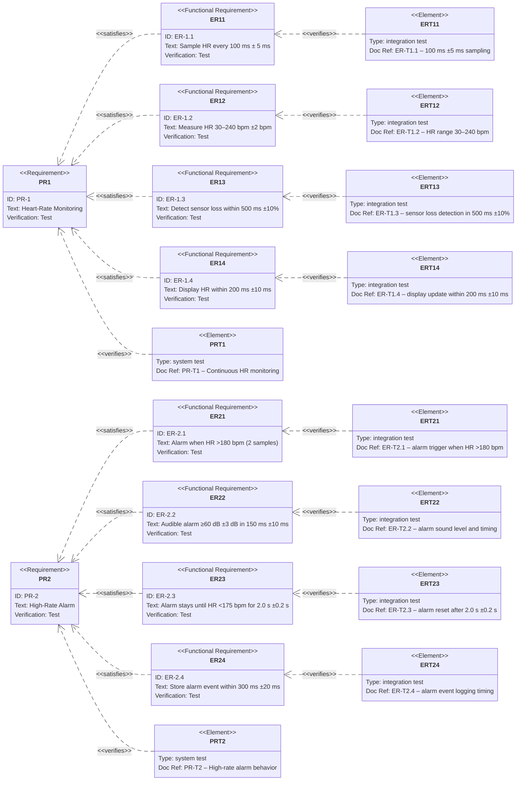

# IEC 62304 for Embedded Medical Software – A Practical Introduction
# Requirements Basics

## 1. Why Requirements Matter  
Requirements are the **foundation** of any safety‑critical system.  
Bad requirements = bad design, even if the code is perfect.

### Common Anti‑Patterns
- Requirements are not written down  
- Vague, incomplete, or conflicting  
- “Just like last version except…”  
- Scope creep (“add this too”)  
- Repeated changes due to unclear goals  

### Real‑World Failure Example  
**FBI Virtual Case File (2005)**  
- Cost: **$170M**  
- Project terminated  
- Root causes:  
  - Requirements undefined when contract signed  
  - “We’ll know it when we see it”  
  - Scope creep of **80%**

---

## 2. What a Requirement *Is*  
A requirement describes **what the system must do**, not how it is implemented.

Good requirements also specify **what the system must NOT do**  
(e.g., “System shall not deliver therapy if sensor is disconnected.”)

Every requirement must be:
- **Precise**  
- **Testable**  
- **Traceable**  
- **Unambiguous**

---

## 3. Characteristics of Good Requirements

### 3.1 Precise & Minimally Constrained  
- Use **shall** = mandatory  
- Use **should** = preferred goal  
- Use numeric values instead of vague terms  
  - Good: “HR alarm triggers at >150 bpm for >2 seconds”  
  - Bad: “Alarm shall trigger for high HR”  
- Include tolerances  
  - Example: “500 ms ± 10%”

### 3.2 Traceable  
Each requirement must have:
- A unique ID (e.g., `R‑1.3`, `MED‑R7`)  
- A corresponding acceptance test

### 3.3 Consistent & Supported  
- Use consistent terminology  
- Provide rationale or constraints  
- No conflicting requirements  

---

## 4. Examples of Good & Bad Requirements  

### Medical Examples  
**Good:**  
- `MED‑R1`: “The device **shall measure heart rate** between 30–240 bpm with an accuracy of ±2 bpm.”  
- `MED‑R3`: “When SpO2 drops below 88% for more than 5 s, the system **shall activate an audible alarm** ≥ 60 dB.”  

**Bad:**  
- “The device shall never fail.” (Untestable)  
- “Alarm should be loud.” (Vague)  
- “Use a 12‑bit ADC to measure HR.” (Implementation detail)

### Automotive Examples  
**Good:**  
- `AUTO‑R8`: “When brake pedal is pressed ≥20%, the system shall activate brake lights within 50 ms.”  
- `AUTO‑R12`: “If airbag sensor self‑test fails, the system **shall illuminate the airbag warning lamp** within 100 ms.”  

**Bad:**  
- “Car shall stop quickly.” (Vague, untestable)  
- “Use CAN message 0x91 for torque command.” (Implementation)

---

## 5. Problematic Requirements (Common Mistakes)

### Untraceable  
- “System shall shut down when E‑STOP is activated.” (Where is the ID?)

### Untestable  
- `R‑1.1`: “System shall never crash.”

### Imprecise  
- `R‑1.7`: “System provides quick feedback.”

### No Tolerance  
- `R‑2.3`: “LED shall flash with period of 500 ms.”  
  (Better: “500 ms ± 5 ms”)

### Overly Complex  
- Long, multi‑action sentences  
- Mixed behaviors in one requirement  

### Implementation-Specific  
- `R‑8.3`: “Add two 16‑bit integers when button W is pressed.”  

---

## 6. Requirements Ambiguity (Funny Example)

A requirements engineer returns with **6 cartons of milk and no eggs.**  
Why?  
Because the requirements were ambiguous.

---

## 7. Extra‑Functional Requirements  
These describe **system qualities**, not functions.

Examples:
- **Performance** (e.g., “System shall process ECG data at 200 Hz”)  
- **Safety** (e.g., “System shall not deliver therapy unless two sensors agree”)  
- **Security**  
- **Power consumption**  
- **Forbidden behaviors** (“shall NOT…”)  

Design constraints might include:
- Must comply with IEC 62304  
- Must use existing hardware platform  
- Must be delivered by date X  

---

## 8. Product vs. Engineering Requirements

### Product Requirements = What the product must offer  
Example (medical):  
- `PR6`: “The device shall support user‑configurable heart‑rate alarm thresholds.”

Example (automotive):  
- `PR3`: “The vehicle shall provide rear obstacle detection to assist drivers.”

### Engineering Requirements = How the system behaves  
Example:  
- `R5`: “When in Alarm‑Set Mode, the ‘+’ button shall increase threshold by 1 bpm.”

---

## 9. Approaches to Writing Requirements

### Text Requirements  
- Natural for domain experts  

### UML Diagram  

### Agile User Stories  

---

## 10. Requirements Templates (EARS Method)

**Syntax:**  
`[While <condition>] [When <trigger>] the <system> shall <response>`

### Examples  
- **Ubiquitous:** “The display shall respond in <250 ms.”  
- **State-driven:** “WHILE charger connected, the device shall reduce CPU load.”  
- **Event-driven:** “WHEN brake pedal is pressed, ECU shall send stop‑lamp command.”  
- **Optional feature:** “WHERE autopilot is installed, lane‑keep assist shall be available.”  

---

## 11. Example: Heart Rate Alert System Requirements  
This example shows how **high‑level product requirements** connect to **detailed engineering requirements**, and how both link to **tests**.

---

### 11.1 Product Requirements (High‑Level)

**PR‑1: Heart‑Rate Monitoring**  
The device shall monitor the user’s heart rate continuously during operation.

**PR‑2: High‑Rate Alarm**  
The device shall alert the user when the heart rate exceeds a dangerous threshold.

---

### 11.2 Engineering Requirements (Derived)

#### For PR‑1  
- **ER‑1.1**: The system shall sample heart rate every 100 ms ± 5 ms.
- **ER‑1.2**: The system shall measure heart rate in the range of 30–240 bpm with an accuracy of ±2 bpm.
- **ER‑1.3**: The device shall detect loss of sensor signal within 500 ms ± 10%.
- **ER‑1.4**: The system shall display the most recent heart‑rate value within 200 ms ± 10 ms of sampling.

#### For PR‑2  
- **ER‑2.1**: The system shall trigger a high‑rate alarm when HR > 180 bpm for 2 consecutive samples, each sample spaced 100 ms ± 5 ms apart.
- **ER‑2.2**: The system shall activate an audible alarm ≥ 60 dB with a tolerance of ±3 dB within 150 ms ± 10 ms of alarm detection.
- **ER‑2.3**: The alarm shall remain active until HR falls below 175 bpm for at least 2.0 s ± 0.2 s.
- **ER‑2.4**: The system shall store an “alarm event” entry in memory within 300 ms ± 20 ms of HR alarm activation.

---

## 11.3 Test Cases (Linked to Requirements)

### Product Requirement Tests  
| Test ID | Verifies | Description |
|--------|----------|-------------|
| **PR‑T1** | PR‑1 | Confirm device continuously measures HR during operation with no gaps > 200 ms. |
| **PR‑T2** | PR‑2 | Simulate HR above threshold and verify user receives visible/audible alert. |

---

### Engineering Requirement Tests  

| Test ID | Verifies | Description |
|--------|----------|-------------|
| **ER‑T1.1** | ER‑1.1 | Inject simulated HR data stream and verify sampling interval is 100 ms ± 5 ms. |
| **ER‑T1.2** | ER‑1.2 | Provide HR values across full range (30–240 bpm) and verify correct measurement. |
| **ER‑T1.3** | ER‑1.3 | Disconnect HR sensor and confirm “sensor loss” detected within 500 ms. |
| **ER‑T1.4** | ER‑1.4 | Verify display updates within 200 ms after each new HR sample. |
| **ER‑T2.1** | ER‑2.1 | Simulate HR > 180 bpm for 2 samples and confirm alarm activates. |
| **ER‑T2.2** | ER‑2.2 | Measure alarm sound pressure to confirm ≥ 60 dB within 150 ms. |
| **ER‑T2.3** | ER‑2.3 | Reduce HR to safe level and verify alarm clears only after 2 s stability. |
| **ER‑T2.4** | ER‑2.4 | Trigger alarm event and confirm an “alarm event” log entry is recorded. |

---

## 11.4 Traceability Summary  
A complete V‑Model requires linking:

PR‑1 → ER‑1.1, ER‑1.2, ER‑1.3, ER‑1.4 → PR‑T1 + ER‑T1.x  
PR‑2 → ER‑2.1, ER‑2.2, ER‑2.3, ER‑2.4 → PR‑T2 + ER‑T2.x  

This ensures:
- Each product requirement has supporting engineering requirements  
- Each engineering requirement has at least one test  
- Tests directly prove requirement correctness

### 11.5 Traceability Diagram (Mermaid)

