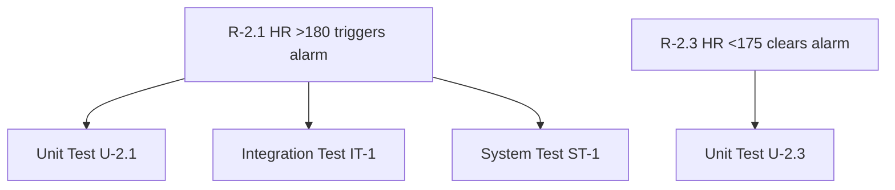

# Session 4 – Testing & Verification

Testing ensures the software is correct, safe, and compliant with **IEC 62304**.  
This session explains **unit testing**, **integration testing**, **system testing**,  
plus online testing options and static analysis.

---

# 1. Why We Test

Testing helps us:
- validate requirements  
- catch bugs early  
- prove safety behavior  
- comply with IEC 62304  

---

# 2. Types of Testing

## 2.1 Unit Testing
Tests **one module in isolation**.

Use unit testing for:
- heart-rate alarm logic  
- threshold checking  
- filtering functions  
- math functions  

Characteristics:
- No hardware  
- Fast and deterministic  
- Uses mocks/fakes  


---

## 2.2 Integration Testing
Tests **multiple modules working together**.

Examples:
- HR logic + Alarm HAL  
- Sensor → Filter → HR Engine  
- Alarm Logic → GPIO  

Goal: verify interactions.

---

## 2.3 System Testing
Tests the **entire device** on real hardware.

Examples:
- Real HR sensor behavior  
- End-to-end flow  
- Timing validation  
- False-alarm resistance  

---

# 3. What We Test in the Heart-Rate Project

| Requirement | Test Type | Example |
|------------|-----------|---------|
| Alarm triggers when HR >180 for 2 samples | Unit Test | `hr_alert_update()` |
| Alarm clears after <175 bpm for 2 seconds | Unit Test | repeated low samples |
| Alarm pin output toggles | Integration Test | logic + alarm HAL |
| Full device behavior | System Test | real hardware |

---

# 4. Unit Testing Example (Arduino-Friendly)

We test **logic only**, no hardware.

### Folder Structure

```
src/
   hr_alert.c
   hr_alert.h

tests/
   unity.c
   unity.h
   test_hr_alert.c
```

### Example Unit Test (Unity)

```c
#include "unity.h"
#include "hr_alert.h"

void setUp(void)
{
    hr_alert_init();
}

void test_alarm_triggers_when_hr_high(void)
{
    hr_alert_update(190);
    hr_alert_update(190);
    TEST_ASSERT_TRUE(hr_alert_is_active());
}

void test_alarm_clears_after_low_hr(void)
{
    hr_alert_update(190);
    hr_alert_update(190);

    for (int i = 0; i < 20; i++)
        hr_alert_update(160);

    TEST_ASSERT_FALSE(hr_alert_is_active());
}

int main(void)
{
    UNITY_BEGIN();
    RUN_TEST(test_alarm_triggers_when_hr_high);
    RUN_TEST(test_alarm_clears_after_low_hr);
    return UNITY_END();
}
```

### example:
https://github.com/jcsb1994/Buzzer/tree/main

---

# 5. Integration Test Example (Fake Sensor)

### Fake Sensor

```c
uint16_t fake_sensor_sequence[] = {120, 150, 200, 200};
int fake_index = 0;

uint16_t sensor_hal_read_bpm(void)
{
    return fake_sensor_sequence[fake_index++];
}
```

### Integration Test

```c
void test_integration_hr_to_alarm(void)
{
    hr_alert_init();

    for (int i = 0; i < 4; i++)
        hr_alert_update(sensor_hal_read_bpm());

    TEST_ASSERT_TRUE(hr_alert_is_active());
}
```

---

# 6. System Test Example (Real Device)

System testing validates real hardware.

Checklist:
- Sensor detection  
- Alarm timing  
- Display state  
- Behavior under noise  
- Behavior under low battery  
- No false alarms  

---

# 7. Requirements Traceability Example



Traceability ensures every requirement is tested.

---

# 8. Recommended Book for Embedded C Unit Testing

## Test-Driven Development for Embedded C  
**by James W. Grenning**

Industry-standard reference for:
- unit testing  
- TDD  
- fakes/mocks  
- testable HAL design  
- embedded refactoring  

Widely used in medical, automotive, and aerospace industries.

---


# 9. Minimal Test Framework (No Unity)

```c
#include <stdio.h>

#define ASSERT_TRUE(x)  if (!(x)) { printf("FAIL at %d\n", __LINE__); return; }

void test_example(void)
{
    ASSERT_TRUE(1 == 1);
}

int main(void)
{
    test_example();
    printf("PASS\n");
}
```


